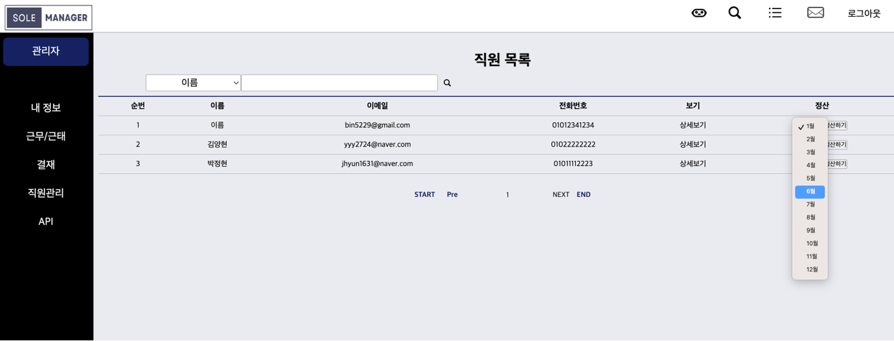

# SpringBoot-Project-SoleManager
>그룹웨어 기본 연동 기능 및 메시지 봇 구현 프로젝트
<br>

# 📍 목차
1. 프로젝트 소개
2. 개발기간
3. 개발환경
4. DB구성
5. 멤버구성
6. 주요기능
<br>

## 🖥️ 프로젝트 소개
> SoleManager는 프리랜서와 회사 간 연결을 중개하는 "프리랜서 중개 에이전시"로 SoleManager의 그룹웨어를 구축합니다.
> 이 그룹웨어는 다음과 같은 3가지의 서비스를 제공합니다.
1. 프리랜서와 회사 간의 적합한 프로젝트를 찾아 매칭하는 서비스 제공
2. 계약서 작성, 결제 처리 및 금융 관련 서비스를 제공
3. 프리랜서와 회사 간의 원활한 커뮤니케이션을 제공
> (추가) OpenAPI를 연동하여 메시지 봇을 구현합니다.
<br>

## ⌛️ 개발 기간
* 23.09.26 ~ 23.10.25 (약 1개월 소요)
* (추가) 23.10.26 ~ 23.11.03 (약 10일 소요)
<br>

## 🛠️ 개발 환경


## ⚙️ DB 구성


## 🏃‍♀️ 맴버 구성
### 김예진(팀장) : 근무/근태(R), 급여(C,R), BaseLayout디자인, 모달디자인, PPT, 영화 API
<details>
  <summary>근무/근태</summary>
  
  > 근무/근태 리스트 보여주기 Controller
  
  ```java
    @GetMapping("/{memberId}/list")
    @ResponseBody
    public Map<String, Object> getWorkTimeWorklist(
            @PathVariable("memberId") Long memberId,
            @RequestParam(value = "workType", required = false) String workType) {
        // json 형태로 front에 넘기기
        Map<String, Object> map = new HashMap<>();

        // 근무기록 list로 가져오기(반환)
        List<WorkTimeDto> workTimeList = workTimeService.getWorkTimeWorkList(memberId,workType);

        map.put("worklist", workTimeList);
        return map;
    }
  ```

  > 근무/근태 리스트 보여주기 Service

  ```java
  public List<WorkTimeDto> getWorkTimeWorkList(Long memberId, String workType) {
        List<WorkTimeDto> workTimeDtoList = new ArrayList<>(); // 반환값이 list이므로 list생성
        List<WorkTimeEntity> workTimeEntityList;

        if (workType == null) {
            // 달만 선택
            workTimeEntityList = workTimeRepository.findByWorkTimeMemberId(memberId);
        } else {
            workTimeEntityList = workTimeRepository.findByWorkTimeWorkType(memberId, workType);
        }

        // 달&유형 선택
        if (!workTimeEntityList.isEmpty()) {
            for (WorkTimeEntity workTimeEntity : workTimeEntityList) {
                WorkTimeDto workTimeDto = WorkTimeDto.toDto(workTimeEntity);
                if (workTimeDto.getWorkType() == WorkType.NORMAL) {
                    workTimeDto.setTitle("근무");
                } else if (workTimeDto.getWorkType() == WorkType.ABSENT) {
                    workTimeDto.setTitle("결석");
                } else if (workTimeDto.getWorkType() == WorkType.EARLY) {
                    workTimeDto.setTitle("조퇴");
                } else if (workTimeDto.getWorkType() == WorkType.TARDY) {
                    workTimeDto.setTitle("지각");
                } else if (workTimeDto.getWorkType() == WorkType.VACATION) {
                    workTimeDto.setTitle("휴가");
                }
                workTimeDtoList.add(workTimeDto);
            }
        }
        return workTimeDtoList;
    }
  ```

</details>

<details>
  <summary>💵월급(급여)정산 및 리스트</summary>
  
  > 월급정산
  
  

  > Controller
  
  ```java
  @PostMapping("/{memberId}")
  @ResponseBody
  public Map<String,Object> getMemberPayMontly(
    @PathVariable("memberId") Long memberId,
    @RequestParam(value = "workMonth", required = false) String workMonth){

      // 달에 해당하는 근무기록 가져오기
      Integer result = payService.postPayList(memberId, workMonth);

      Map<String,Object> map = new HashMap<String,Object>();
      map.put("result", result);
      return map;
  }
  ```

  > Service
     
  ```java
  public Integer postPayList(Long memberId, String workMonth) {
    //이미 정산 내역이 있다면
    List<PayEntity> payEntityList = payRepository.findByPayMonth(memberId,workMonth);
      if(payEntityList.size() != 0){
        return 0;
      }
    PayEntity payEntity = new PayEntity();
    MemberEntity memberEntity = new MemberEntity();
    List<WorkTimeEntity> workTimeEntityList = workTimeRepository.findByWorkTimeMonth(memberId, workMonth);
      Integer sum = 0;
      for(WorkTimeEntity workTimeEntity : workTimeEntityList){
        sum += workTimeEntity.getTotal(); // total 계산
      }
      Integer pay = (sum / 60) * 10000; // 월급 계산
      memberEntity.setId(memberId); // memberId가져오기
      payEntity.setMonthly(workMonth); // 월급 구분
      payEntity.setPrice(pay); // 월급 저장
      payEntity.setIsPay(1); // 월급 지급 여부 설정 1
      payEntity.setIs_display(1); //
      payEntity.setMemberEntity(memberEntity); // member정보 저장
      payEntity.setPayDay(LocalDate.now()); // 월급 기록 당일 저장
      Optional<Long> payId = Optional.ofNullable(payRepository.save(payEntity).getId());
      //값이 존재
      if (payId.isPresent()) {
        return 1;
      }
      return 0;
    }
    ```

    > 월급목록

    

    > 월급목록 Controller
    
    ```java
  
    ... 월별 ...
    @PostMapping("/{memberId}")
    @ResponseBody
    public Map<String,Object> getMemberPayMontly(
            @PathVariable("memberId") Long memberId,
            @RequestParam(value = "workMonth", required = false) String workMonth){

        // 달에 해당하는 근무기록 가져오기
        Integer result = payService.postPayList(memberId, workMonth);

        Map<String,Object> map = new HashMap<String,Object>();
        map.put("result", result);
        return map;
    }

    ... 년도별 ...
    @GetMapping("/yearList/{memberId}")
    @ResponseBody
    public List<PayDto> getMemberPayYearly(
            @PathVariable("memberId") Long memberId,
            @RequestParam(value = "workYear", required = false) String workYear){

        // 년에 해당하는 근무기록 가져오기
        List<PayDto> result = payService.getPayYearList(memberId, workYear);

        return result;
    }
    ```
    <br>

    > 월급목록 Service
    
    ```java
    ... 월별 ...
    public List<PayDto> getPayMonthlyList(Long memberId) {
        List<PayDto> payDtoList = new ArrayList<>();
        List<PayEntity> payEntityList  = payRepository.findBymemberEntity_Id(memberId);
        if(!payEntityList.isEmpty()){
            for(PayEntity payEntity : payEntityList){
                PayDto payDto = PayDto.toDto(payEntity);
                payDtoList.add(payDto);
            }
        }
        return payDtoList;
    }

    ... 년도별 ...
    public List<PayDto> getPayYearList(Long memberId, String workYear) {
        List<PayDto> payDtoList = new ArrayList<PayDto>();
        List<PayEntity> payEntityList = payRepository.findByPayYear(memberId, workYear);
        for (PayEntity payEntity: payEntityList) {
            payDtoList.add( PayDto.toDto(payEntity));
        }
        return payDtoList;
    }
    ```

</details>

<details>
  <summary>레이아웃 디자인</summary>
  <ul>
    <li>레이아웃 디자인</li>
    
  </ul>
</details>

<br>
김** : 로그인, 이메일 인증, 비밀번호 재설정, 권한별 LIST, 로그인&회원가입 디자인, 날씨 API
<br>
박** : 게시판(CRUD), 댓글, 파일, FUllCalendar일정추가, 웹소캣 알림 챗봇, 메인페이지디자인, PPT, 버스 API
<br>
방** : 회원(CRUD), 회원페이지 디자인, 날씨 API
<br>
안** : 결재(CRUD), 버스 API
<br>
이** : 근무/근태(CUD), FUllCalendar(근무,프리랜서일정), 네이버웍스 구현, CI/CD, 영화 API

## 주요기능
